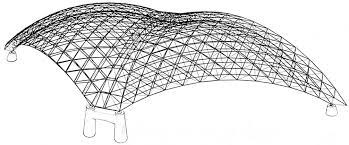

This is a Finite Element Program for the MIC-412 class at the Universidad Tecnica Federico Santa Maria.

Structural ANalysis in 2D (AE_2D)
=================================

**AE_2D** is a software for solving structural mechanics problem in 2D. The format and code struture are presented in the assignment. The software covers:
    
* Linear operator for assembly and constraints
* Implementation of Truss and Frame elements
* Implementation of Static analysis
* Global to local coordinate transformations
* Solution of Practical engineering problems 
    
Theory and Documentation 
========================
*Computational Solid and Structural Mechanics*, Danilo S. Kusanovic, 2023.
